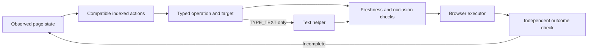

# Typed Decision Models: Jev, Harnesses and Evaluation

Reviewed: 2026-09-21. This is a source review, not a reproduced benchmark or a trading recommendation. It extends modules 3, 7, 8 and 13 of the [syllabus](syllabus.md).

## What Changes In The Stack

Not every model call needs to generate prose. A decision model can choose among caller-defined alternatives; ordinary code controls the next step. This adds an implementation option inside the existing inference, routing and orchestration layers, not a new value-chain layer.

| Component | CTX category | What the evidence supports |
| --- | --- | --- |
| TypeSafe Jev | Inference / provider APIs; supports routing | Hosted typed decisions, not a general text generator |
| RLCD | Post-training concept | TypeSafe's named training approach; not an independently reproduced recipe |
| Jev Ultrafast | Harness / tool infrastructure and verification; orchestration | Observed actions, typed selection, separate text helper |
| JevBench | Evaluation / performance optimization | Inspectable scoring and run artifacts, with material limitations |
| Jev Trader | Vertical application / workflow research | A decision-to-execution demo, not evidence of profitable trading |
| Laya | Inference / local runners; routing | Separate open-weight decision models, not released Jev weights |
| Laya-MLX | Inference / local runners and optimization | Independent Apple Silicon runtime for Laya checkpoints |

## Model Contract And RLCD

TypeSafe documents Choice, Score and Noul primitives over supplied state, with probabilities and, for Choice/Score, confidence. Questions can be grouped while branching remains in application code. [API introduction](https://docs.typesafe.ai/introduction).

The September 15 announcement names Reinforcement Learning for Calibrated Decisions (RLCD) as its training method. Treat this as the vendor's description. The announcement's speed, cost and hallucination claims do not establish those properties for an arbitrary workload. In particular, matching a declared output type does not imply selecting the correct action. [Announcement](https://typesafe.ai/blog/introducing-system-one-models-and-jev).

A useful composition is speculative fan-out: ask the branch selector and possible branch-specific questions together, then consume only the relevant answers. A proposed safe application adds task-calibrated confidence thresholds, an abstention path and deterministic authorization before effects. [Fan-out documentation](https://docs.typesafe.ai/patterns/fan-out).

## Browser Harness Pattern

Jev Ultrafast reconstructs compatible operation/target choices from observed DOM controls. The operation and potential targets share a request; only the selected operation's target is used. A separate model generates text for TYPE_TEXT. This is not evidence that Jev performs screenshot perception or that a large planning model directs a small executor. [Pinned model implementation](https://github.com/browser-use/jev-ultrafast/blob/1231850a0bf1a0c0341fe408ef1668dbbfdfac46/jev_ultrafast/model.py).

The repository reports a 7.073-second flight-search recording. Its matched comparison is three runs per runtime using the same models: median 9.450 versus 7.092 seconds. This measures a harness change on one task, not general model superiority. Setup, initial navigation and independent post-run verification are outside the timer; reported helper charges are not total task cost. [Pinned measurement boundaries](https://github.com/browser-use/jev-ultrafast/blob/1231850a0bf1a0c0341fe408ef1668dbbfdfac46/docs/performance.md).

The implementation still needs fresh target validation and an independent success check. The documented MVP excludes frames, shadow roots, canvas and several other interactions. [Pinned limitations](https://github.com/browser-use/jev-ultrafast/blob/1231850a0bf1a0c0341fe408ef1668dbbfdfac46/README.md#evidence-and-limits).

## JevBench: Read Components Before Rankings

The reviewed repository revision includes the v1.2.11 openness correction. Its v1.2 suite contains 534 decisions, including a 220-item hard tier with 109 held-out items. Public artifacts therefore do not make the entire evaluation independently reproducible. Native probability distributions and probabilities written out by text models are labeled separately. [Pinned methodology](https://github.com/fstandhartinger/jevbench/blob/bb83e5da8bbb040aa772bcfe4c6275408dbeb831/README.md).

The v1.2 composite equally weights intelligence, calibration, speed and cost using a geometric mean. It adjusts non-production latency by 2x, adding 0.15 seconds for the author's own servers. Those adjustments are assumptions, not measured production performance. Changing component definitions, weights or cost estimates can change rank without improving a model. [Pinned scoring code](https://github.com/fstandhartinger/jevbench/blob/bb83e5da8bbb040aa772bcfe4c6275408dbeb831/jevbench/composite_v12.py).

For a routing decision, retain the revision, task distribution, per-axis results, raw latency, price basis and calibration convention. Test option-order sensitivity and thresholds on the intended task. No universal leaderboard winner is asserted here.

## Jev Trader: Keep The Evidence Boundary

The checked configuration defaults to `MODEL=mock` and dry-run when no private key is present. The mock model includes an 80 ms sleep. Those timings cannot verify live Jev inference. [Configuration](https://github.com/jarrodwatts/jev-trader/blob/b587759e459ea049590102e54a0b07800864cdc3/src/config.ts), [model code](https://github.com/jarrodwatts/jev-trader/blob/b587759e459ea049590102e54a0b07800864cdc3/src/model.ts).

There is also a contract mismatch: the model instructions describe spread-crossing immediate-or-cancel execution, while the README describes post-only resting orders. Submitted intent, placed orders and actual fills are distinct events. This makes the demo useful for studying integration boundaries, not for inferring profitability. [Pinned execution documentation](https://github.com/jarrodwatts/jev-trader/blob/b587759e459ea049590102e54a0b07800864cdc3/README.md).

## Open-Weight Alternatives: Laya And Laya-MLX

The open-weights link points to **Convai Innovations' Laya**, not TypeSafe releasing Jev's weights. The model card describes English, multilingual and task-tuned checkpoints using bidirectional encoders and decision heads. Its Jev comparison uses third-party results with different prompts and samples; it is not a matched head-to-head test. [Model card](https://huggingface.co/convaiinnovations/laya).

Laya's own documentation reports overconfidence before domain calibration, language-dependent failures and limited option-token budgets. Its strong typed-decisions result comes from a checkpoint fine-tuned on that benchmark's training split. Treat checkpoint selection, language coverage and calibration as deployment requirements, not details hidden behind a speed comparison. [Pinned upstream limitations](https://github.com/NandhaKishorM/laya/blob/42626c348753fbb17572a813127df2278a1ec527/README.md#honest-limits).

Laya-MLX is an independent native port. The published M3 Max measurements report 13.42 ms and 7.39 ms median for single short questions on English and multilingual FP16 checkpoints. Loading is excluded. Peak MLX allocation is 943.6/687.6 MiB for those cases but exceeds 1 GiB for ten full-context questions. Consequently, neither a universal 1 GB cap nor a 50x advantage over Jev follows from these local measurements. Port parity tests measure agreement with upstream, not general decision accuracy. [Pinned local benchmarks](https://github.com/mizorewww/laya-mlx/blob/fc1df62828a3fedf4d8229fdac1cbd85f1cdf337/BENCHMARKS.md).

The game's visible safety layer can override model proposals. Its multi-question move loop is different from the single-question API benchmark. Record interventions and task success separately from raw decision throughput. [Pinned runtime overview](https://github.com/mizorewww/laya-mlx/blob/fc1df62828a3fedf4d8229fdac1cbd85f1cdf337/README.md).

## Validation Exercise

- Define allowed choices, rejection conditions and effect permissions before making model calls.
- Separate schema validity, decision accuracy, calibration and end-to-end task success.
- Compare identical tasks and harnesses; record model IDs, source commits, failures, p50/p95 latency and complete costs.
- Test stale observations, wrong-but-valid choices, low confidence and duplicate execution.
- Keep discovery posts as pointers, not proof; preserve primary citations with every promoted claim.
- Deliver a decision contract, a no-side-effect test fixture and a pass/fail evidence log. Do not run a live trading experiment as this exercise.
